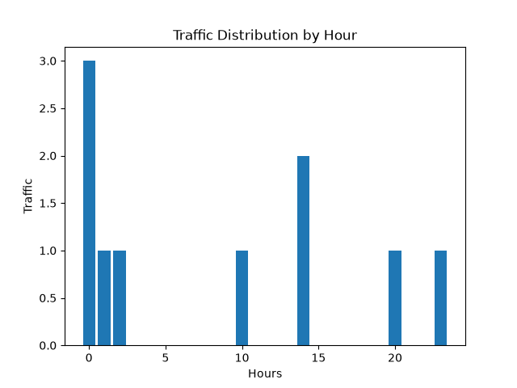

# Traceweave

A command-line HTTP log analyzer built in Python. Parses Common Log Format (CLF) files, computes traffic summaries with pandas, and generates a text report and an hourly traffic chart.

Built and validated against the NASA HTTP Logs dataset, but works with any log file in Common Log Format.

## Overview

Traceweave takes a raw HTTP access log and turns it into a structured analysis: status codes, HTTP methods, top hosts, resource types, and hourly traffic distribution. It is a single-file CLI tool designed to show a clean, readable pipeline architecture: file reading, regex parsing, DataFrame construction, analysis, and report generation are handled by five separate classes, each with one responsibility.

## Features

- Parses Common Log Format log lines with a single compiled regex
- Categorizes HTTP status codes (Success, Redirect, Client Error, Server Error)
- Categorizes requested resources by file extension
- Computes 5 summaries: status, HTTP method, top hosts, resource type, hourly traffic
- Generates a text report (screen and/or file) and a matplotlib bar chart of hourly traffic
- Configurable via `argparse`, no interactive input required
- Handles missing files and malformed logs without crashing, with clear warning messages

## Demo

Sample input and output are in the `examples/` folder (`sample_log.txt`, `hourly_chart.png`).

Run it:

```bash
python main.py --file examples/sample_log.txt
```

Hourly traffic chart:



Text report excerpt:

```
Status summary
Success         5
Redirect        2
Client Error    2
Server Error    1

Method summary
GET     9
POST    1

Host summary
burger.letters.com       2
netcom17.netcom.com      2
unicomp6.unicomp.net     1
199.120.110.21           1
205.212.115.106          1
d104.aa.net              1
piweba3y.prodigy.com     1
alyssa.prodigy.com       1

Resource summary
Directory        3
html             3
gif              1
jpeg             1
No extension     1
jpg              1

Hourly summary
0     3
1     1
2     1
10    1
14    2
20    1
23    1
```

## Installation

Requires Python 3.10 or later (uses `X | Y` union type hints).

```bash
git clone https://github.com/boccassinisergio-afk/Traceweave.git
cd Traceweave
pip install pandas matplotlib
```

## Usage

```bash
python main.py --file log.txt
```

Optional arguments:

```bash
python main.py --file log.txt --export report.txt --chart hourly_chart.png
```

| Argument   | Required | Default             | Description                     |
|------------|----------|----------------------|----------------------------------|
| `--file`   | Yes      | -                    | Path to the log file to analyze |
| `--export` | No       | `report.txt`         | Path where the text report is saved |
| `--chart`  | No       | `hourly_chart.png`   | Path where the hourly chart is saved |

## Pipeline architecture

```
FileReader -> LogParser -> DataFrameBuilder -> Analyzer -> ReportGenerator
```

- **FileReader**: reads the raw log file from disk, line by line
- **LogParser**: parses each raw line into an `HTTPRequest` object using the CLF regex, collecting unparsed lines separately instead of failing on them
- **DataFrameBuilder**: converts the list of parsed `HTTPRequest` objects into a pandas DataFrame
- **Analyzer**: adds derived columns (status category, resource category, parsed datetime) and computes the 5 summaries
- **ReportGenerator**: formats the summaries into a text report and a bar chart

## Regex breakdown

```
unicomp6.unicomp.net - - [01/Jul/1995:00:00:06 -0400] "GET /shuttle/countdown/ HTTP/1.0" 200 3985
│                    │   │                              │     │                 │         │    │
│                    │   │                              │     │                 │         │    └── Bytes transferred
│                    │   │                              │     │                 │         └─────── HTTP status
│                    │   │                              │     │                 └───────────────── Protocol
│                    │   │                              │     └─────────────────────────────────── Requested resource
│                    │   │                              └───────────────────────────────────────── HTTP method
│                    │   └──────────────────────────────────────────────────────────────────────── Timestamp
│                    └──────────────────────────────────────────────────────────────────────────── identd / userid (ignored)
└───────────────────────────────────────────────────────────────────────────────────────────────── Host/IP client
```

## Roadmap

Not yet implemented, planned as future iterations:

- Logging (currently uses `print` for warnings)
- Automated tests
- HTML report output
- Packaging for distribution (`pyproject.toml`, PyPI)
- Possible refactor from a single `main.py` into separate modules (`parser.py`, `analyzer.py`, `report_generator.py`, ...), same behavior, cleaner structure

## Tech stack

Python, pandas, matplotlib, `re`, `argparse`

## Author

Sergio Boccassini

- GitHub: [boccassinisergio-afk](https://github.com/boccassinisergio-afk)
- LinkedIn: [sergio-boccassini](https://www.linkedin.com/in/sergio-boccassini)
- X: [@boccassini_ai](https://x.com/boccassini_ai)